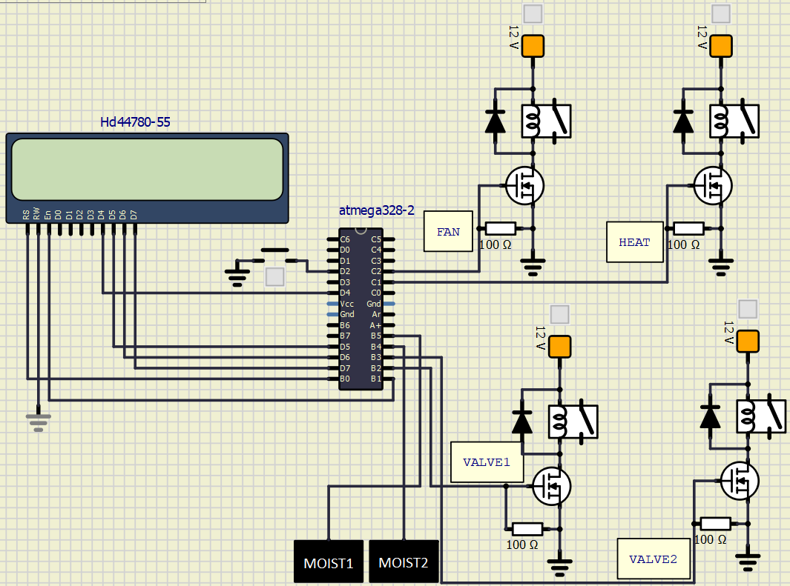
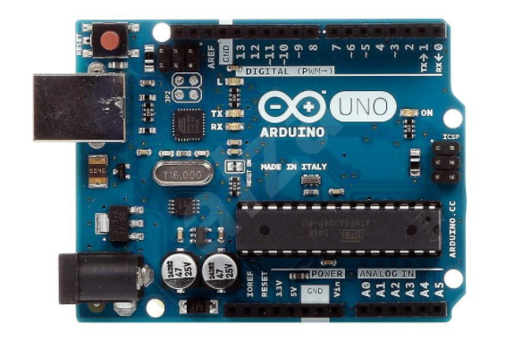

# Greenhouse

### Team members

* Aleš Horna
* Jakub Hlaváček
* Vojtěch Hroch

Link to this file in your GitHub repository:

[https://github.com/your-github-account/repository-name/project](https://github.com/...)

### Table of contents

* [Project objectives](#objectives)
* [Hardware description](#hardware)
* [Libraries description](#libs)
* [Main application](#main)
* [Video](#video)
* [References](#references)

## Project objectives

### Scheme:

   

## Hardware description
For measuring we used capacitance and temperature sensors. When the temperature was higher than the desired value, the system turns on the fans to lower the temperature on the contrary when the temperature reached a value lower, than the desired value, the system turns on the heating. 

Soil moisture level measurement is based on the electric resistance of the soil, therefore the moisture sensor is very simple, it consists of two wires sticked into the soil. Based on data provided by moisture senzor are the valves to irrigation pumps controlled.

### Arduino uno

   

Flash memory 32 KB, 14 digital pins a 6 analog pins, range USB a SPI.

## Libraries description
In this project we utilized libraries such as: "avr/io.h", "avr/interrupt.h", "util/delay.h", "stdlib.h", "math.h", "timer.h", "gpio.h", "lcd.h" and lcd_definitions.h

#### <avr/io.h>
This library contains IO (input/output) definitions for the devices based on AVR type of chip.

#### <avr/interrupt.h>
Library is used in the project to handle the interrupts

#### <util_delay.h>
Library "util_delay.h" is utilized for the definition of CPU frequency, also can be used for example as busy-wait function.

#### <stdlib.h>
This library defines variable types.

#### <math.h>
The math.h header defines various mathematical functions and one macro.

#### <timer.h>
In this library are defined overflows for interrupts.

#### <gpio.h>
This library is used for AVR pin configurations.

#### <lcd_definitions.h>, <lcd.h>
Those two libraries are utilized to control the LCD. Concretely the "lcd.h" library defines place (coordinates) to write the message on LCD (function: lcd_gotoxy), also the message itself (lcd_puts). The "lcd-definitions.h" library defines LCD pins.
## Main application

Write your text here.

## Video
The video describing our project was made in OpenShot software environment. The monolog in this video is made by Vojtěch Hroch.

## References

### 1. 
[YouTube](https://www.youtube.com/)

### 2. 
[Tomas-Fryza/Digital-electronics-2](https://github.com/tomas-fryza/Digital-electronics-2)
