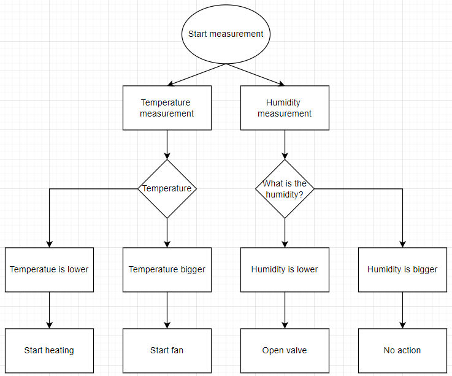
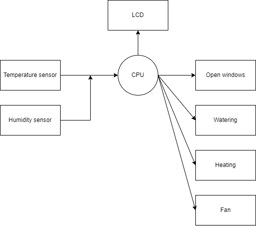
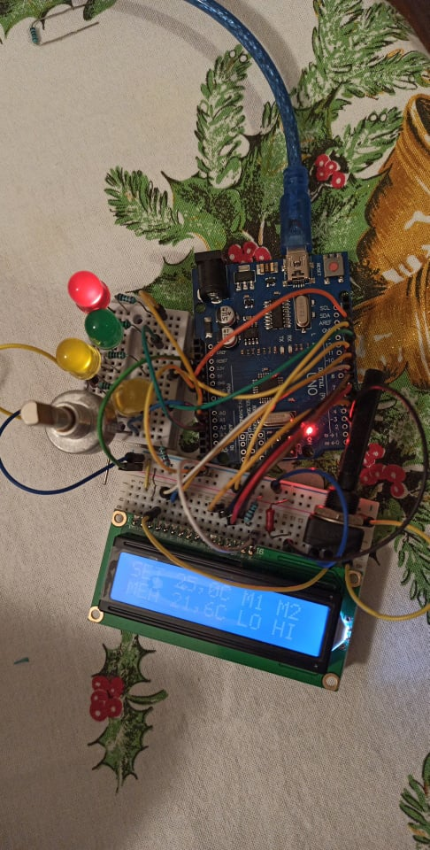

# Greenhouse

Link to GitHub repository:

https://github.com/xhroch01/DE2-project

### Team members

* Aleš Horna (responsible for code writing and implementation/simulation)
* [GitHub reference](https://github.com/xhorna16/Digital-electronics-2)
* Jakub Hlaváček (responsible for README.md file completition and finishing touches)
* [GitHub reference](https://github.com/Jakubhl/Digital-electronics-2)
* Vojtěch Hroch (responsible for video presentation and diagrams)
* [GitHub reference](https://github.com/xhroch01/Digital-electronics-2)

### Table of contents

* [Project objectives](#objectives)
* [Hardware description](#hardware)
* [Libraries description](#libs)
* [Main application](#main)
* [Video](#video)
* [References](#references)

<a name="objectives"></a>

## Project objectives
The main objective is to implement techniques to control greenhouse. Explained by diagrams below.

### Scheme:

   
   
### Flowchart
   

### Block diagram
   

## Hardware description
For measuring we used capacitance and temperature sensors. When the temperature was higher than the desired value, the system turns on the fans to lower the temperature on the contrary when the temperature reached a value lower, than the desired value, the system turns on the heating. 

Soil moisture level measurement is based on the electric resistance of the soil, therefore the moisture sensor is very simple, it consists of two wires sticked into the soil. Based on data provided by moisture senzor are the valves to irrigation pumps controlled.

### Arduino uno

   

Flash memory 32 KB, 14 digital pins a 6 analog pins, range USB a SPI.

### LCD
   
   
2 rows, 16 characters 

### TC1046
High Precision Temperature-to-Voltage Converter

[TC1046 datasheet](https://ww1.microchip.com/downloads/en/DeviceDoc/21496C.pdf?fbclid=IwAR3JS0fTOTgRv-BpEHv4b_GTBlFUy0KrOrPso-AE79n30IDYJwicSIyW-h8)

### Humidity sensor
   
<a name="libs"></a>

## Libraries description
In this project we utilized libraries such as: "avr/io.h", "avr/interrupt.h", "util/delay.h", "stdlib.h", "math.h", "timer.h", "gpio.h", "lcd.h" and lcd_definitions.h

#### <avr/io.h>
This library contains IO (input/output) definitions for the devices based on AVR type of chip.

#### <avr/interrupt.h>
Library is used in the project to handle the interrupts

#### <util_delay.h>
Library "util_delay.h" is utilized for the definition of CPU frequency, also can be used for example as busy-wait function.

#### <stdlib.h>
This library defines variable types.

#### <math.h>
The math.h header defines various mathematical functions and one macro.

#### <timer.h>
In this library are defined overflows for interrupts.

#### <gpio.h>
This library is used for AVR pin configurations.

#### <lcd_definitions.h>, <lcd.h>
Those two libraries are utilized to control the LCD. Concretely the "lcd.h" library defines place (coordinates) to write the message on LCD (function: lcd_gotoxy), also the message itself (lcd_puts). The "lcd-definitions.h" library defines LCD pins.
## Main application

### Program
Sem bych hodil bloky kˇodů a pospsal je
```c
    while (1)
    {
		    if ((GPIO_read(&PIND, BUTTON)) == 0)                 // button is pushed
		    {
			    temperature_set = temperature_set + 1;
			    lcd_gotoxy(4, 0);
				char temperature_set_itoa[2] = "--";
				itoa(temperature_set, temperature_set_itoa, 10); // temperature is converted into a string
			    lcd_puts(temperature_set_itoa);                  // temperature is displayed
			    if (temperature_set == 41)                       // maximum demandable temperature is exceeded
			    {
				    temperature_set = 10;
				    lcd_gotoxy(4, 0);
					char temperature_set_itoa[2] = "--";
					itoa(temperature_set, temperature_set_itoa, 10);
				    lcd_puts(temperature_set_itoa);
			    }
		    }
    }
```
```c

```
### Implementation
tady bych hodil zpracování, foto zapojeni atd



<a name="video"></a>

## Video
The video describing our project was made in OpenShot software environment. The monolog in this video is made by Vojtěch Hroch.


<a name="references"></a>

## References

### 1. 
[YouTube](https://www.youtube.com/watch?v=zIkkEqXffzc)

### 2. 
[Tomas-Fryza/Digital-electronics-2](https://github.com/tomas-fryza/Digital-electronics-2)
